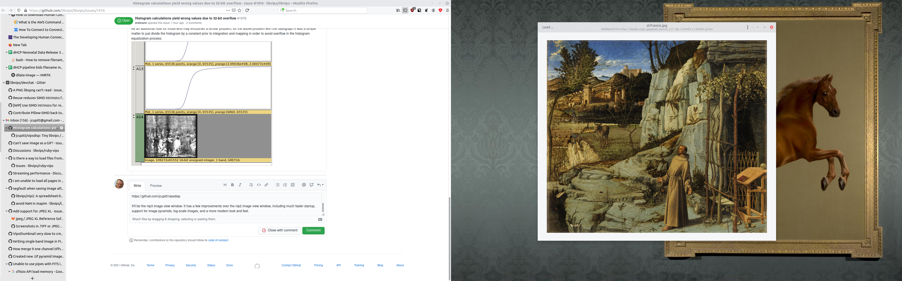
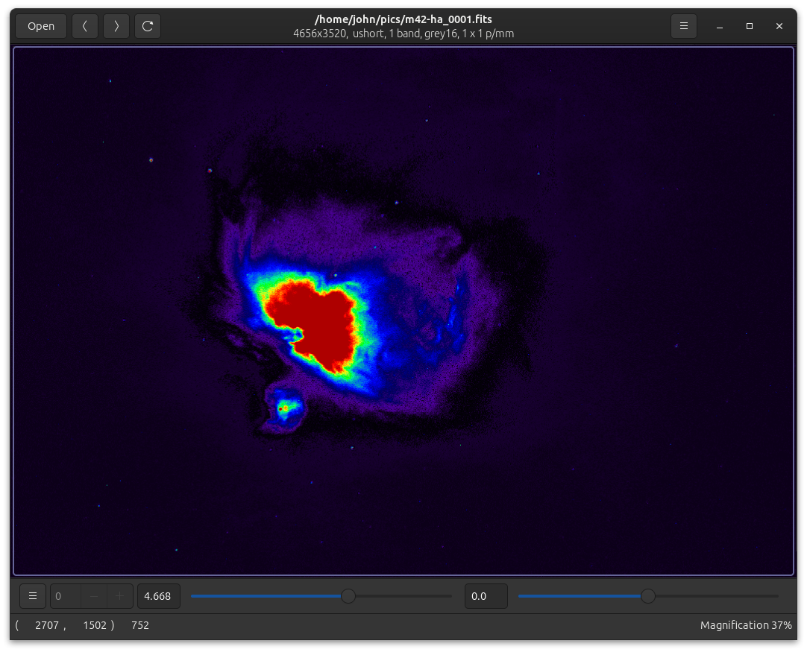

# vipsdisp

This program displays an image with libvips and gtk+4. This is supposed
to be a slightly useful image viewer. It can display huge (many, many GB)
images quickly and without using much memory. It supports many scientific
and technical image formats, including TIFF, WEBP, JP2K, JXL, PNG, JPEG,
SVS, MRXS, OpenEXR, GIF, PDF, SVG, FITS, Matlab, NIfTI, Analyze, etc. It
supports pixel types from 1 bit mono to 128-bit double precision complex.

All of the UI can make finding the details of image display in the sourcecode
difficult. See [vipsdisp-tiny](https://github.com/libvips/vipsdisp-tiny) for
a minimal example --- that's a libvips image viewer in about 300 lines of
very commented C.

## Screenshots

It all works, though see the TODO list below.

[](images/shot1.png)

[](images/shot2.png)

[](images/shot3.png)

## Install

This program is on flathub, see:

https://flathub.org/apps/search/org.libvips.vipsdisp

Just click "install".

## Features

* It supports many scientific and technical image formats, including TIFF,
  WEBP, JP2K, JXL, PNG, JPEG, SVS, MRXS, OpenEXR, GIF, PDF, SVG, FITS,
  Matlab, NIfTI, Analyze, etc. It supports many numeric pixel types, any
  number of image bands, many colour spaces.

* It has Save as, so you can use it for image format conversion. Though
  there's currently no GUI for save options, sadly.

* It doesn't need to keep the whole image in memory. It will only read parts 
  that it needs for display, and it understands most pyramidal image formats.
  This means you can open and view huge images quickly.

* It has threaded, asynchronous image repaint, so display pixels are
  computed in the background by a pool of workers and tiles are rendered to
  the screen as they are finished. The interface stays live even under very
  heavy load.

* Select *Display control bar* from the top-right menu and a useful
  set of visualization options appear. It supports four main display modes:
  Toilet roll (sorry), Multipage, Animated, and Pages as Bands.

* In Toilet roll mode, a multi-page image is presented as a tall, thin strip
  of images. In Multipage, you see a single page at a time, with a page-select
  spinner (you can also use the `crtl-<` and `ctrl->` keys to flip pages). In
  animated mode, pages flip automatically on a timeout. In pages-as-bands
  mode, many-page single-band images (eg. OME-TIFF) are presented as a 
  single colour image.

* You can select falsecolour and log-scale filters, useful for many scientific
  images. Scale and offset sliders let you adjust image brightness to see into
  darker areas (useful for HDR and many scientific images).

* It uses the gtk4 GUI toolkit, so the interface is fast, attractive
  and nicely animated. The image is rendered with the GPU, so display ought to
  be fast.

## Build from source

You need gtk4. On Ubuntu 22.04, build with:

```
$ cd gtk
$ meson build . \
  --prefix=/home/john/vips \
  --libdir=/home/john/vips/lib 
  -Dintrospection=disabled \
$ cd build
$ ninja
$ ninja install
```

Then for vipsdisp:

```
$ cd vipsdisp
$ meson setup build --prefix=~/vips
$ cd build
$ ninja
$ ninja install
```

And to run:

```
$ export GSETTINGS_SCHEMA_DIR=/home/john/vips/share/glib-2.0/schemas
$ vipsdisp ~/pics/k2.jpg
```

## Shortcuts

* Cursor keys to scroll around
* Cursor keys plus shift to move by a screen size
* Cursor keys plus ctrl to move to image edges
* Number keys to pick a particular magnification
* Ctrl + number keys to pick a particular zoom out
* 0 for best fit
* d, to toggle debug rendering mode
* i, + / o, - to zoom in and out
* ctrl-<, ctrl->. prev page, next page
* Mouse drag to pan
* Mousewheel to zoom
* Mousewheel + shift/ctrl to pan
* ^O replace image
* ^N new viewer
* ^D duplicate view
* F11 fullscreen

## Structure

* `TileSource` wraps a `VipsImage` and can produce pyramid tiles on request.
   It has controls for things like scale and falsecolour.

* `TileCache` builds a sparse pyramid of tiles and keeps recents.

* `Imagedisplay` is a `GtkDrawingArea` subclass that paints a `TileCache`. It
  implements a scrollable interface. You can use this as an image view
  widget in your own code. It takes a float scale factor for zoom and uses
  that to fetch tiles of the right size from the `TileCache`.

* `Imagewindow` is a GtkWindow that contains an `Imagedisplay` and 
  adds a lot of navigation stuff. It uses the scolled
  window `GtkAdjustment` to slide `Imagedisplay` around.

* `disp` is the `main()`, `VipsdispApp` is a `GtkApplication` subclass

* The UI layout is in the `gtk/*.ui` xml.

## TODO

- allow eg. "vipsdisp x.svg[scale=10]", the load dialog should have a
  "load options" expander, and save should have "save options"

- can we move "new_from_file" into a bg thread? the GUI will pause on huge
  SVGs on zoom change right now

- tile read errors:

    $ ./src/vipsdisp ~/pics/ome/LuCa-7color_Scan1.ome.tiff 

        - (vipsdisp:110067): VIPS-WARNING **: 18:05:16.244: 
            error in tile 0 x 256: tiff2vips: 
                out of order read -- at line 3328, but line 256 requested

    page 0, subifd 2 and subifd 3 are untiled!!!

    we need to decompress the whole layer before we view :( 

- need to separate page and zoom for ome-tiff, since we have many-page
  subifd pyramids

    - useful for fixing PDF zoom in the way we fixed SVG zoom too

- pages as bands

    $ ./src/vipsdisp ~/pics/ome/LuCa-7color_Scan1.ome.tiff 

        flip to last page, zoom, lots of repaint errors

        maybe join first N pages (while pages same size) in pages as bands 
        mode?

        does not page flip to smaller pages correctly

            reset zoom/scroll on pagegflip if the page size changes?

        same for audi r8 pdf page flip I guess?

- colour:

    - with eg. SVS, we won't get the ICC profile from openslide

        - maybe fetch the profile ourselves with a tiffopen? we'll need a
          special path for this

- info bar:

    - update pixel value in a bg thread? we do it in the GUI thread right now
      and it can cause terrible hitching

    - pages as bands ... info bar displays only one band

    - will not display complex numbers correctly ... need to unpack to bands,
      or does getpoint do this already?

- zooming:

    - better pinch zoom support

        we should take the coordinates of the pinch gesture into account

    - zoom / zoom in menu item could step in by more, and animate the zoom as
      well?

    - we could shrink tiles on zoom out (we only expand tiles now)

    - before we can do fancy PDF zooming, we'll need to split page and zoom in
      tile_source_open()

- how should we handle images which include labels, macros, thumbnails?

    - load options? save options? 

- flatpak build needs git master libvips

- add imagemagick to get dicom loader?

- auto reload on file change, or support F5 for reload?

- load image with long progress bar, ^D during load, progress bar stops
  updating

- no progress bar for replace? it works for initial load though

- progress bar occasionally never shows even on a long load

- header display

## Version bump checklist

Version needs updating in the following places:

- **`org.libvips.vipsdisp.appdata.xml`** and some release notes and a date as
  well.

- **`org.libvips.vipsdisp.json`** needs the version number as a git tag.

## flatpak

Add the `flathub` repo:

```
flatpak remote-add --if-not-exists \
  flathub https://flathub.org/repo/flathub.flatpakrepo
```

Install the gtk4 SDK and runtime:

```
flatpak install org.gnome.Sdk//43
flatpak install org.gnome.Platform//43
```

Allow file. Recent security changes to git will cause submodule checkout
to fail inside flatpak. If you get errors like `fatal: transport 'file'
not allowed`, reenable file transport with:

```
git config --global protocol.file.allow always
```

Build and try running it:

```
flatpak-builder --force-clean --user --install build-dir org.libvips.vipsdisp.json
flatpak run org.libvips.vipsdisp ~/pics/k2.jpg
```

Force a complete redownload and rebuild (should only rarely be necessary) with:

```
rm -rf .flatpak-builder
```

Check the files that are in the flatpak you built with:

```
ls build-dir/files
```

Uninstall with:

```
flatpak uninstall vipsdisp
```

## Notes on flatpak build process

- niftiio is annoying to build, skip it.

- we skip imagemagick as well, too huge

## Packaging for flathub

Install the appdata checker:

```
flatpak install flathub org.freedesktop.appstream-glib
flatpak run org.freedesktop.appstream-glib validate org.libvips.vipsdisp.appdata.xml
```

Also:

```
desktop-file-validate org.libvips.vipsdisp.desktop 
```

## Uploading to flathub

Push to master on:

        https://github.com/flathub/org.libvips.vipsdisp 

then check the build status here:

        https://flathub.org/builds/#/apps/org.libvips.vipsdisp
