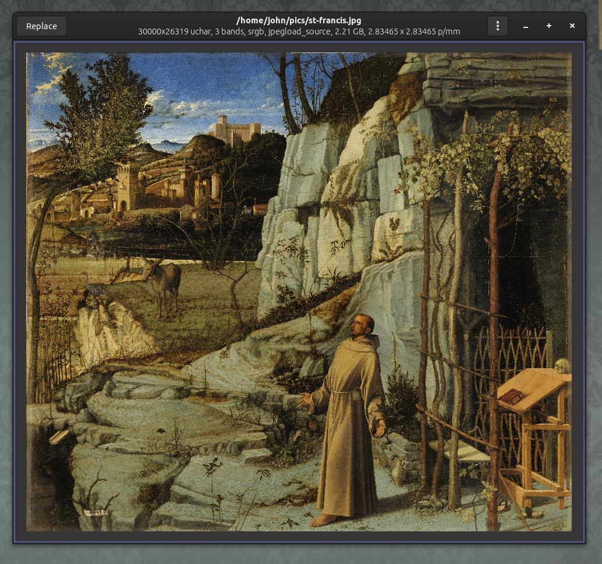
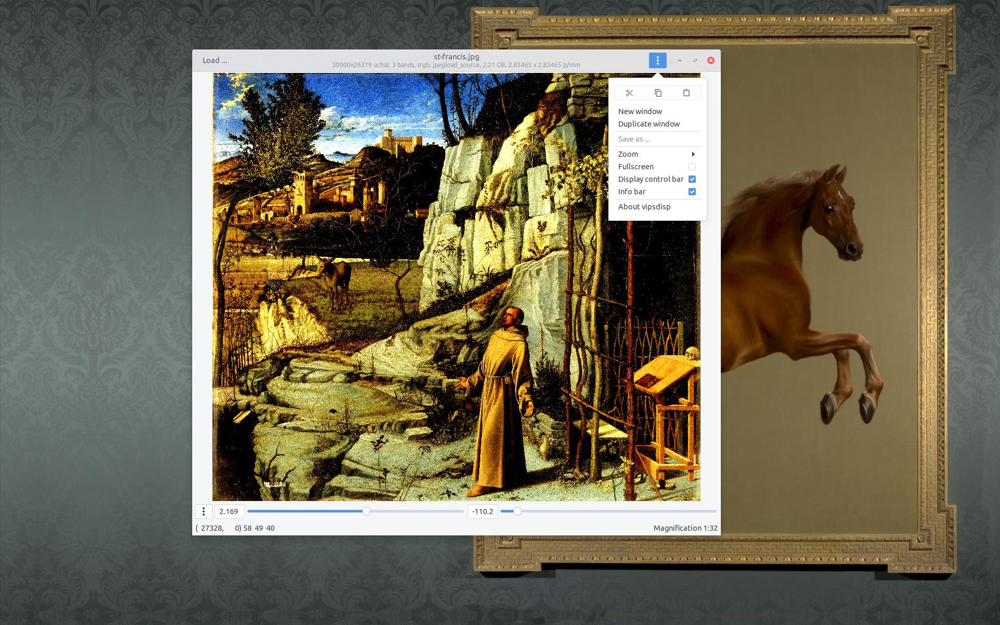
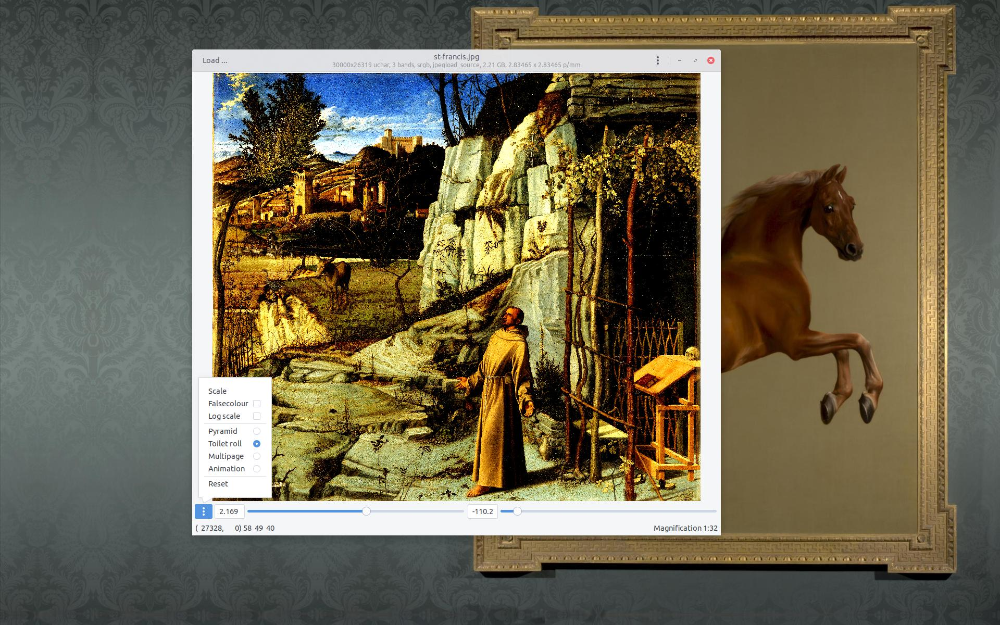

# vipsdisp


C program to display an image with vips8 and gtk+3. This is supposed to be
a slightly useful image viewer. It can display huge (many, many GB) images
quickly and without using much memory.

See vipsdisp-tiny for a minimal example.

### Screenshots

It all works, though see the TODO list below.

[](images/shot1.jpg)

[](images/shot2.jpg)

[](images/shot3.jpg)

### To run

```
$ ./autogen.sh --prefix=/home/john/vips 
$ make
$ ./vd ~/pics/k2.jpg
```

### Shortcuts

* Cursor keys to scroll around
* Cursor keys plus shift to move by a screen size
* Cursor keys plus ctrl to move to image edges
* Number keys to pick a particular magnification, 0 for best fit
* i, + / o, - to zoom in and out
* , . prev page, next page
* Mouse drag to pan
* Mousewheel to zoom
* Mousewheel + shift/ctrl to pan
* ^O replace iamge
* ^N new viewer
* ^D duplicate view
* F11 fullscreen

### Structure

* `Imagedisplay` is a `GtkDrawingArea` subclass that paints a `VipsImage`. It
implements a scrollable interface.

* `Conversion` is a GObject which manages the image that is being
displayed. Set things like magnification, file, scale, offset etc. on this
and the display will update automatically.

* `Conversionview` is the view for the conversion model.

* `Imagepresent` is a `GtkScrolledWindow` subclass that contains an
`Imagedisplay` and a `Conversion` and adds a lot of navigation stuff. It
uses the scolled window `GtkAdjustment` to slide `Imagedisplay` around,
and sets properties of `Conversion` to zoom etc.

* `Imageview` is a `GtkApplicationWindow` subclass that contains an
`Imagepresent` plus a header bar and some other UI bits.

* `disp` is the `main()`, `Disp` is a `GtkApplication` subclass

### TODO

- move to gtk4 (see gtk4 branch of vipsdisp)

- load image with long progress bar, ^D during load, progress bar stops
  updating

- show checkerboard for transparency?

- header display

- load options? save options? eg. load SVG at $x DPI

- see https://wiki.gnome.org/HowDoI/CustomWidgets and make sure we do all that

- perhaps convert to scrgb before scale/offet? we'd maybe keep float precision
  then?
